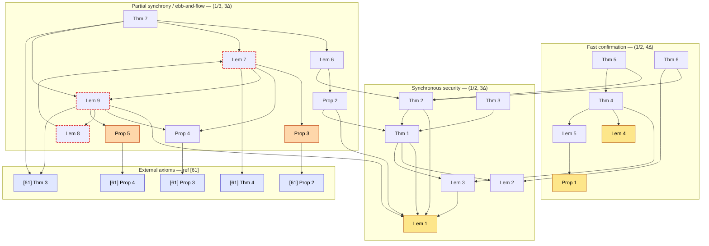

# goldfish-fv

The paper's 21 numbered statements (Theorem 1–7, Lemma 1–9, Proposition 1–5) are formalized here. This README documents the proof discipline, the barriers and the decision for each, the dependency graph, and the Lean module layout.
Build toward a formalization of the Goldfish safety and liveness results, using the paper's numbered statements as the specification target.

## Source

Francesco D'Amato, Joachim Neu, Ertem Nusret Tas, David Tse — *Goldfish: No More Attacks on Ethereum?!*

- IACR ePrint: <https://eprint.iacr.org/2022/1171>
- arXiv: <https://arxiv.org/abs/2209.03255> (v4, 2023-12-30)
- Published at Financial Cryptography 2024

Algorithms 1–6, Figure 7, and the prose sections of the paper are intentionally omitted — they are protocol pseudocode and commentary rather than statements to formalize.

## Barriers and decisions

### 1. Probability (`w.o.p.` / Chernoff)

`w.o.p.` ("with overwhelming probability", i.e. except with probability `negl(κ) + negl(λ)`) appears throughout. The probabilistic core is exactly **Lemma 1, Lemma 4 and Proposition 1** (VRF-lottery + Chernoff bounds giving an honest majority among eligible voters and an upper bound on voter count). Every other statement is deterministic *given* those conclusions.

Concentration inequalities (Chernoff/Hoeffding) are **not in core Mathlib**; they exist only in specialized libraries (e.g. `lean-stat-learning-theory`). Proving them from measure theory is research-level work.

**Decision.** Thread the good event as a hypothesis into the deterministic theorems (fully proved), and declare Lemma 1 / Lemma 4 / Proposition 1 as `axiom`. Dependents can then proceed immediately. The measure-theoretic proof that replaces each axiom is developed separately, so it never blocks the deterministic proofs.

**Status.** The measure-theoretic layer lives in `Goldfish.Probabilistic`: the abstract sub-Gaussian machinery (`Basic`, `CountBound`, `LeaderWindow`) is fully proved, and `Goldfish.Probabilistic.Lottery` builds the concrete product-Bernoulli lottery model (`Measure.infinitePi` over per-`(slot, validator)` eligibility draws and per-slot leader draws) and proves the good-event failure bound `lemma1_good_event_bound` with explicit constants (margin `g = ε·thr·n₀` from the `Compliant` fields, sub-Gaussian parameter `c = |V|/4` via Hoeffding's lemma, per-window miss `(1 − p₀)^κ`). What remains of the `lemma1` / `lemma4` axioms is a documented model-instantiation gap — VRF pseudorandomness ⇒ iid Bernoulli, probabilistic execution semantics, and the finite-horizon reading of the all-slots quantifier — spelled out in the docstring of `lemma1_good_event_bound`.

### 2. External reference [61] (Ebb-and-Flow)

Theorem 7, Lemma 7, Lemma 9 and Propositions 3–5 rely on results from the accountability-gadget paper [61] (Neu, Tas, Tse — *The Availability-Accountability Dilemma and its Resolution via Accountability Gadgets*, [ePrint 2021/628](https://eprint.iacr.org/2021/628) / [arXiv:2105.06075](https://arxiv.org/abs/2105.06075)). Goldfish's Lemmas 7–9 and Propositions 3–5 are stated as analogues of that paper's Thm 4 / Lem 1 / Thm 5 and Prop 2 / 3 / 4. Formalizing [61] is out of scope.

**Decision.** Declare each imported [61] result as an `axiom` with a source comment in a central module (see Module layout).

### 3. Protocol mechanics (GHOST-Eph, slots, voting)

The formalization deliberately omits Algorithms 1–6, but the theorem statements need the fork-choice rule, slot structure and voting behaviour.

**Decision.** Do not implement the algorithms operationally. Provide fork-choice / slot / voting behaviour as an **abstract interface (a structure or typeclass of hypotheses)** and derive the theorems from it. An executable model can replace the interface later without changing the theorem statements.

### 4. Ebb-and-flow cyclic dependency

In the partial-synchrony / ebb-and-flow proofs the dependencies form a cycle: **Lemma 7 → Lemma 9 → Lemma 8 → Lemma 7** (the healing argument is a mutual induction).

**Decision.** Prove the three together as one simultaneous induction. The cyclic dependencies among them are discharged by the joint induction rather than one at a time; the out-of-bundle dependencies (Lemma 1, Proposition 4, Propositions 3/5, the [61] axioms) must still be resolved separately.

## Proof layers and dependency graph

Three layers, built in order. The synchronous-security layer is self-contained; fast confirmation and partial synchrony / ebb-and-flow each depend on it.

- **Synchronous security** (`Goldfish.SynchronousSecurity`): Thm 1–3, Lem 2–3 (Lem 1 is an axiom in `Goldfish.Axioms`). Reorg resilience + security under `(1/2, 3∆)`-compliance.
- **Fast confirmation** (`Goldfish.FastConfirmation`): Thm 4–6, Lem 5 (Lem 4 and Prop 1 are axioms in `Goldfish.Axioms`). `(1/2, 4∆)`-compliance.
- **Partial synchrony / ebb-and-flow** (`Goldfish.EbbAndFlow`): Thm 7, Lem 6–9, Prop 2–5. `(1/3, 3∆)`-compliance, accountability gadget overlay.

Dependency graph (an arrow `A → B` means *A's proof depends on B*; `[61]` nodes are external axioms from ref [61]). The graph records the **paper's** dependency structure; in the Lean code, edges into axiomatized statements are realized by threading their conclusions as hypotheses, and some edges are packaged as interface fields rather than direct lemma invocations (e.g. Thm 4 uses the `Spec4Δ` field `fast_outvotes_of_honest_majority` — the 4∆ analogue of Lem 3 — instead of Lem 3 itself, and Prop 1 anchors the `confirms_of_honest_votes` field behind Thm 6 rather than being invoked by Lem 5):

Legend: amber = axiom assumed `w.o.p.` (Lem 1, Lem 4, Prop 1 — VRF lottery + Chernoff); orange = axiom with no paper proof, taken as the [61] analogue (Prop 3, Prop 5); indigo = external [61] axiom; red dashed border = the Lem 7 → Lem 9 → Lem 8 → Lem 7 cyclic bundle proved by one simultaneous induction. Lem 2 is deterministic with no dependencies.
